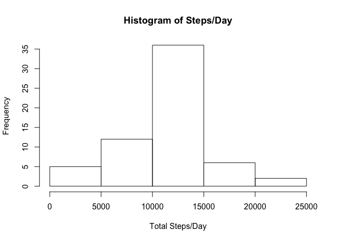

# Reproducible Research: Peer Assessment 1


## Loading and preprocessing the data


```r
data <- read.csv("activity.csv") #load the data, no preprocessing required
```

## What is mean total number of steps taken per day?


```r
#sum the steps by date and plot on histogram, then take mean and median
steps_per_day <- aggregate(steps ~ date, data, sum)
hist(steps_per_day$steps, xlab = "Total Steps/Day", main="Histogram of Steps/Day")
```

<!-- -->

```r
mean_steps <- mean(steps_per_day$steps)
median_steps <- median(steps_per_day$steps)
```

The mean number of steps per day is 1.0766189\times 10^{4} and the median is 10765.

## What is the average daily activity pattern?


```r
#take mean of the steps by interval number and plot a line graph, then find max
steps_per_interval <- aggregate(steps ~ interval, data, mean)
plot(steps_per_interval$interval, steps_per_interval$steps, type="l", xlab="Interval", ylab="Mean Steps/Interval")
```

<!-- -->

```r
max_interval <- steps_per_interval$interval[which.max(steps_per_interval$steps)]
```

The interval with the highest average step count is interval 835.

## Imputing missing values


```r
#find missing values for each column, then sum together
#(for this dataset only steps are missing, so other two not technically needed)
stepsna <- sum(is.na(data$steps))
datena <- sum(is.na(data$date))
intervalna<- sum(is.na(data$interval))
nacount <- stepsna + datena + intervalna
#clone the dataset and replace NAs with interval averages
data2 <- data
data2$steps[is.na(data2$steps)] <- steps_per_interval$steps
#sum the steps by date, plot on histogram, and take new mean and median
steps_per_day2 <- aggregate(steps ~ date, data2, sum)
hist(steps_per_day2$steps, xlab = "Total Steps/Day", main="Histogram of Steps/Day")
```

<!-- -->

```r
mean_steps2 <- mean(steps_per_day2$steps)
median_steps2 <- median(steps_per_day2$steps)
```

With NA step values replaced with the mean number of steps for that interval from complete entries, the mean number of steps per day is now 1.0766189\times 10^{4} and the median 1.0766189\times 10^{4}.

## Are there differences in activity patterns between weekdays and weekends?


```r
#create vector of true/false values to identify weekdays and append to table
weekday <- weekdays(as.Date(data$date), TRUE)
weekday <- !(weekday == "Sat" | weekday == "Sun")
data3 <- cbind(data2, weekday)
#take mean of steps by interval for weekdays and weekends separately
steps_interval_wkdy <- aggregate(steps~interval,subset(data3,data3$weekday==TRUE), mean)
steps_interval_wknd <- aggregate(steps~interval,subset(data3,data3$weekday==FALSE), mean)
#plot means by interval one atop the other for comparison
par(mfcol=c(2,1), mar=c(5,4,4,2))
plot(steps_interval_wknd$interval, steps_interval_wknd$steps, type="l", xlab="", main="Weekend", ylab="Number of Steps",  ylim=c(0,230), yaxp=c(0,200,4))
plot(steps_interval_wkdy$interval, steps_interval_wkdy$steps, type="l", xlab="Interval", main="Weekday", ylab="Number of Steps", ylim=c(0,230), yaxp=c(0,200,4))
```

<!-- -->
